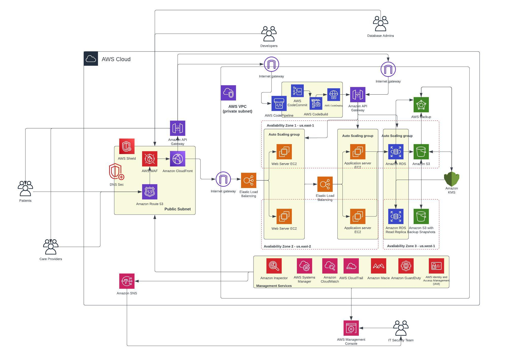

# NortonHealthcare Infrastructure Project

This repository contains the Terraform infrastructure code for managing AWS services such as AWS Firewall, Route 53, CloudFront, API Gateway, AWS Backup, GuardDuty, Macie, and CloudWatch, with an emphasis on security and HIPAA compliance for NortonHealthcare.

## Table of Contents
- [Architecture](#architecture)
- [Features](#features)
- [Regions Used](#regions-used)
- [Setup Instructions](#setup-instructions)
- [HIPAA Compliance](#hipaa-compliance)
- [Disaster Recovery Plan](#disaster-recovery-plan)
- [License](#license)

## Architecture

The following architecture demonstrates the overall cloud infrastructure designed for NortonHealthcare, including integrations for DNSSEC, Route 53, CloudFront, API Gateway, and various security services.



## Features
- **Route 53**: DNS security and routing are configured to protect DNS integrity.
- **AWS Firewall Manager**: Provides centralized management of VPC security policies.
- **CloudFront**: Content distribution for API Gateway and other static content.
- **API Gateway**: Secure API Gateway setup with Route 53 routing.
- **SNS Notifications**: Real-time notifications for the IT Security team.
- **AWS Backup**: Automated backups for RDS and S3 resources, integrated with KMS for encryption.
- **GuardDuty and Macie**: Security monitoring for unusual behavior and sensitive data discovery.
- **CloudWatch and CloudTrail**: Monitoring and logging of infrastructure activity.

## Regions Used

This infrastructure spans multiple AWS regions to ensure high availability and fault tolerance. The following regions are used for resource creation and destruction:

- **us-east-1**: Primary region for resource creation, including Route 53, CloudFront, and API Gateway.
- **us-east-2**: Backup region for disaster recovery, hosting redundant resources such as RDS and S3.
- **us-west-2**: Additional region for high availability and backup configurations.
- **eu-west-2**: European region for data redundancy and used for automated backups.

Resources are distributed across these regions to ensure multi-region redundancy and compliance with disaster recovery plans.

## Setup Instructions

### Prerequisites
- AWS CLI and Terraform installed
- AWS Account with the necessary permissions

### Steps to Deploy
1. Clone this repository:
    ```bash
    git clone https://github.com/jmajety-lab/Norton-Healthcare.git
    cd Norton-Healthcare
    ```
2. Initialize Terraform:
    ```bash
    terraform init
    ```
3. Validate the configuration:
    ```bash
    terraform validate
    ```
4. Plan the deployment:
    ```bash
    terraform plan
    ```
5. Apply the configuration:
    ```bash
    terraform apply
    ```

Make sure you have validated and created for all the four regions.

### Destroying Resources

To destroy the resources created by Terraform, run the following command:

```bash
terraform destroy
```